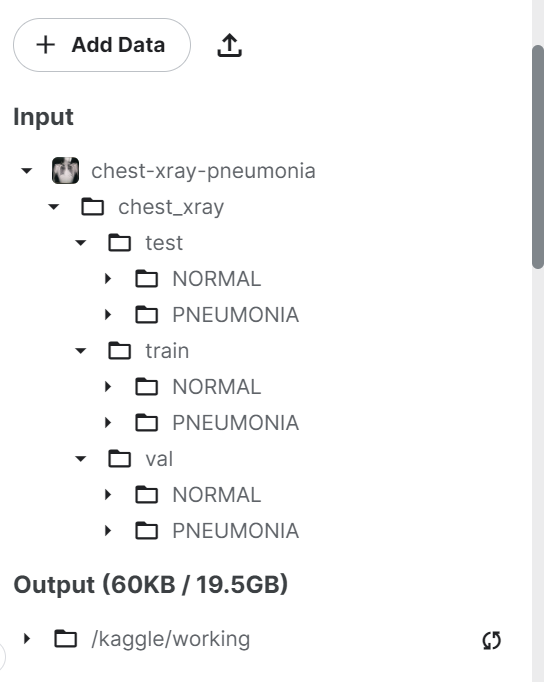
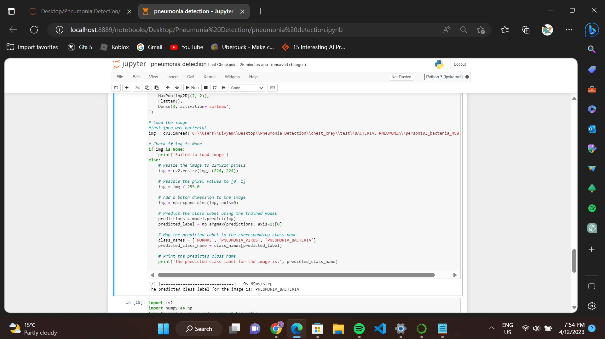
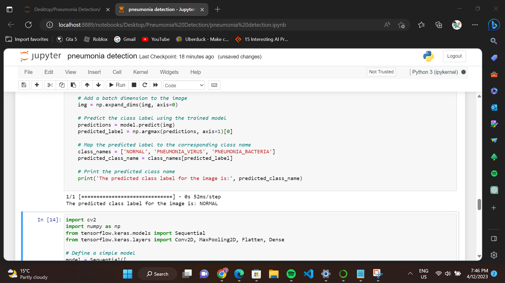
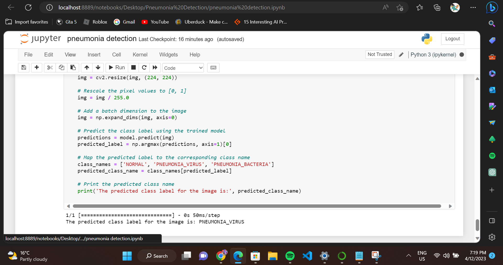

# Pneumonia detection system using Tensorflow keras library

<h5>Pneumonia is a common and potentially life-threatening lung infection that affects millions of people worldwide. Early detection and treatment are critical for successful management of this disease. Artificial Intelligence (AI) and Machine Learning (ML) have shown tremendous promise in improving the accuracy and speed of medical diagnoses, including pneumonia detection. In this project, we will explore the application of AI and ML techniques to detect pneumonia from chest X-ray images. By developing a pneumonia detection model, we aim to assist healthcare professionals in providing accurate and timely diagnosis to patients, ultimately improving outcomes and saving lives.  My model is trained to classify chest x-ray images into three categories: Normal, Viral Pneumonia, or Bacterial Pneumonia</h5>
 

The file structure for my dataset is
 
 

### Dataset used :
you can download dataset from here <a href = "https://www.kaggle.com/datasets/paultimothymooney/chest-xray-pneumonia">Kaggle Chest xray pneumonia Dataset</a>

### Model used :
VGG 16 https://www.mathworks.com/help/deeplearning/ref/vgg16.html#:~:text=VGG%2D16%20is%20a%20convolutional,%2C%20pencil%2C%20and%20many%20animals

## Result :
Pneumonia chest xrays gets classified into Viral , Bacterial or Normal

when i passed an image that was of Bacterial Pneumonial Category

when i passed an image that was of normal category

when i passed an image that was of Viral Pneumonial category

## Libraries used : 
<a href = "https://www.tensorflow.org/guide/keras/train_and_evaluate"> Tensorflow library - Keras </a>

## Kaggle notebook link for the project I made using another way (which classifies as NORMAL or PNEUMONIAL)
<a href = "chest-xray-detection-kaggle.ipynb">chest-xray-detection-kaggle.ipynb</a>
 
https://www.kaggle.com/code/divyam6969/chest-xray-classifier
